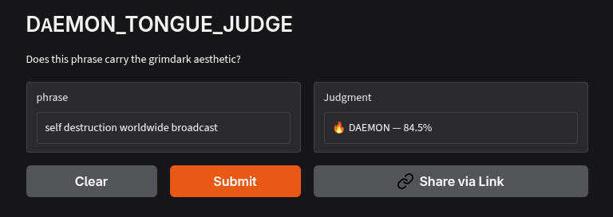

# DAEMON TONGUE

<p align="center">
  
<p>

> A classifier for grimdark phrases — dark, poetic, fatalistic aesthetic.

Trained on dark quotes and lyrics.  
Classifies phrases as **DAEMON** (grimdark aesthetic) or **MORTAL** (everything else).

<p align="center">
  
<p>

HuggingFace Spaces link: [`44WXNRFEELSLIKEPINSANDNEEDLESINMYHEART/DAEMON_TONGUE`](https://huggingface.co/spaces/44WXNRFEELSLIKEPINSANDNEEDLESINMYHEART/DAEMON_TONGUE)

Just a classifier. Nothing unusual.

---

## Quickstart

```bash
uv sync
uv run src/predict.py
```

## Training

```bash
uv run src/train.py
```

## Dataset

1000+ manually labeled phrases _(as of 09.06.2026)_.  
Columns: `phrase,label,source`.  
Label `1` = grimdark aesthetic (dark, poetic, fatalistic).  
Label `0` = neutral, mechanical, or plainly aggressive.

## The loop

Every round of data work runs the same five steps:

```bash
uv run src/scraper/wikiquote_parser.py      # 1. scrape  -> data/unlabeled_*.csv
uv run src/review_predictions.py            # 2. predict -> data/high_confidence_review.csv
                                            # 3. review the labels by hand
uv run src/merge_labeled.py data/high_confidence_review.csv   # 4. merge -> data/dataset.csv
uv run src/train.py && uv run src/push.py --tag v2            # 5. retrain and publish
```

Scrapers merge into their staging file rather than overwriting it, so labels
entered by hand survive a re-scrape. Add `--semantic-dedup` to step 4 to drop
reworded near-duplicates (needs `uv sync --extra dedup`).

### Sources

| Route | Wikis |
| ----- | ----- |
| Wikiquote API | 40k, Diablo, Souls, Lovecraft, Poe, Milton, Dante |
| Fextralife API | Elden Ring, DS3, Demon's Souls, Sekiro, Bloodborne |
| Fandom API | LoL, Darkest Dungeon, Dark Souls 1 |

Fandom now refuses scripted clients. Save the page from a browser and pass
`--local <dir>` to the scraper instead.

## API

```bash
uv run uvicorn api:app --app-dir src --port 8000
curl -X POST localhost:8000/predict -H 'Content-Type: application/json' \
     -d '{"phrase": "The blood of the fallen will anoint me"}'
# {"phrase":"...","label":1,"name":"DAEMON","confidence":0.99}
```

`POST /predict/batch` takes `{"phrases": [...]}`. `docker build -t daemon-tongue .`
builds the same service as a container.

## Development

```bash
uv sync --dev
uv run ruff check .
uv run pytest
```

## Model

Hosted on HuggingFace: `44WXNRFEELSLIKEPINSANDNEEDLESINMYHEART/DAEMON_TONGUE_JUDGE`

```python
from transformers import pipeline
clf = pipeline("text-classification", model="44WXNRFEELSLIKEPINSANDNEEDLESINMYHEART/DAEMON_TONGUE_JUDGE")
clf("The blood of the fallen will anoint me")
# [{'label': 'DAEMON', 'score': 0.94}]
```

## Labels

| Label | Name   | Meaning                                       |
| ----- | ------ | --------------------------------------------- |
| `1`   | DAEMON | Dark, poetic, fatalistic — grimdark aesthetic |
| `0`   | MORTAL | Neutral, mechanical, plainly aggressive       |

---
# DAEMON TONGUE

> Классификатор гримдарк-фраз — тёмная, поэтическая, фаталистическая эстетика.

Обучен на тёмных цитатах и лирике. 
Классифицирует фразы как **DAEMON** (гримдарк-эстетика) или **MORTAL** (всё остальное).

<p align="center">
  
<p>

Ссылка на HuggingFace Spaces: [`44WXNRFEELSLIKEPINSANDNEEDLESINMYHEART/DAEMON_TONGUE`](https://huggingface.co/spaces/44WXNRFEELSLIKEPINSANDNEEDLESINMYHEART/DAEMON_TONGUE)

Просто классификатор. Ничего необычного.

---

## Быстрый старт

```bash
uv sync
uv run src/predict.py
```

## Обучение

```bash
uv run src/train.py
```

## Датасет

1000+ вручную размеченных фраз _(по состоянию на 09.06.2026)_.  
Колонки: `phrase,label,source`.  
Метка `1` = гримдарк-эстетика (тёмное, поэтическое, фаталистическое).  
Метка `0` = нейтральное, механическое или просто агрессивное.

## Цикл работы с данными

```bash
uv run src/scraper/wikiquote_parser.py      # 1. сбор      -> data/unlabeled_*.csv
uv run src/review_predictions.py            # 2. предсказание -> data/high_confidence_review.csv
                                            # 3. ручная проверка меток
uv run src/merge_labeled.py data/high_confidence_review.csv   # 4. мерж -> data/dataset.csv
uv run src/train.py && uv run src/push.py --tag v2            # 5. переобучение и публикация
```

Скрейперы дописывают в staging-файл, а не перезаписывают его — проставленные
вручную метки переживают повторный запуск. Флаг `--semantic-dedup` на шаге 4
убирает переформулированные дубликаты (нужен `uv sync --extra dedup`).

### Источники

| Маршрут | Вики |
| ------- | ---- |
| Wikiquote API | 40k, Diablo, Souls, Лавкрафт, По, Мильтон, Данте |
| Fextralife API | Elden Ring, DS3, Demon's Souls, Sekiro, Bloodborne |
| Fandom API | LoL, Darkest Dungeon, Dark Souls 1 |

Fandom больше не отдаёт данные скриптам. Сохраните страницу из браузера и
передайте скрейперу `--local <dir>`.

## API

```bash
uv run uvicorn api:app --app-dir src --port 8000
curl -X POST localhost:8000/predict -H 'Content-Type: application/json' \
     -d '{"phrase": "The blood of the fallen will anoint me"}'
```

`POST /predict/batch` принимает `{"phrases": [...]}`. `docker build -t daemon-tongue .`
собирает тот же сервис в контейнер.

## Разработка

```bash
uv sync --dev
uv run ruff check .
uv run pytest
```

## Модель

Размещена на HuggingFace: `44WXNRFEELSLIKEPINSANDNEEDLESINMYHEART/DAEMON_TONGUE_JUDGE`

```python
from transformers import pipeline
clf = pipeline("text-classification", model="44WXNRFEELSLIKEPINSANDNEEDLESINMYHEART/DAEMON_TONGUE_JUDGE")
clf("The blood of the fallen will anoint me")
```

## Метки

| Метка | Название | Значение                                                 |
| ----- | -------- | -------------------------------------------------------- |
| `1`   | DAEMON   | Тёмное, поэтическое, фаталистическое — гримдарк-эстетика |
| `0`   | MORTAL   | Нейтральное, механическое, просто агрессивное            |

---
## Ход работы и сложности

> [!Последнее обновление: 09.06.2026]
### Первоначальный сбор данных
Для старта были выбраны: 
- Фразы Атрокса (AATROX) из компьютерной игры League of Legends - богатый источник красивых речевых конструкций антагониста, включающий в себя упоминания таких тем, как: резня, смерть, убийство, враг всего живого, боги на небесах, сокрущение богов, аннигиляция, абсолютная тишина, губитель мира.
>   _"I can smile, and murder while I smile."_
>   _"Gods and mortals, they deserve only death!"_
>   _"I will drown them in oceans of blood!"_
>   _"Cleave through them, Aatrox! Crush their skulls! Shatter their ribs! Disembowl their very souls!" Aatrox breathes heavily. "Our vengeance is at hand!"_
- Названия и описания предметов из The Binding of Isaac - располагает краткими фразами, пропитанными необходимой эстетикой. Однако многие из них являются пограничными случаями, которые сложно единозначно трактовать, поэтому они являются неоптимальным вариантом.
  При парсинге учитывались только фразы, состоящие из 3 слов и более.
>   _Reusable evil... but at what cost?_
>   _Rise from the grave
>   We all float down here..._

Все данные были размечены вручную, потому что задача достаточно специфичная.
### Первый инференс
Как и ожидалось, изначально модель триггерили такие слова, как: "kill", "death" и т.д., даже если они не образуют ничего особенного. Были вручную добавлены пограничные случаи, где явно показано, что нужно считать за эджовые.

### Масштабирование пайплайна _(18.09.2026)_
- **Рассинхрон train/inference.** `predict.py` нормализовал текст (нижний регистр, без пунктуации), а `train.py` — нет: модель училась на одном виде текста, а судила другой. Нормализация вынесена в `src/text.py` и применяется в обоих местах. **Это изменение вступит в силу при следующем переобучении.**
- **Предсказания затирали исходный текст.** `predict()` возвращал нормализованную фразу, и она попадала в `high_confidence_review.csv`, а оттуда в датасет. Теперь возвращается оригинал.
- **Скрейперы затирали staging-файлы.** Перезапуск скрейпера перезаписывал файл целиком и стирал уже проставленные метки. Теперь запись идёт слиянием по фразе.
- **Добавление API.** Пока что не запушено на HF, но оно само по себе это немного избыточно, так как это уже представлено в HF Spaces (хоть и менее продуктивное), также как и сама модель, к которой можно получить доступ через HF Inference API, третий способ вызова кажется действительно лишним, но он существует просто как возможность.
- **Разметка.** Новые данные пока что не размечались, желания делать это другой моделью (вероятно, какой-нибудь LLM) нет, в основном потому что ее не так просто передать, это 100% возможно, но я делаю это как чувствую для себя. добавлено лишь пару дополнений в самый первый базовый датасет, например: модель сильно триггерилась на слово corpse, так что такие словосочетания как "my corpse" выдавали около 70% уверенности в DAEMON, что, конечно, не должно быть так.

> *Модель на HF на 19.09.26 еще не обновлена*